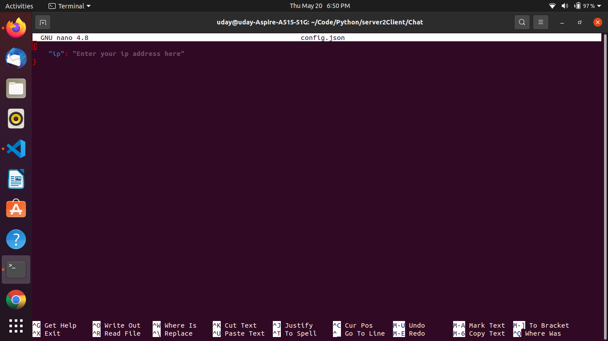
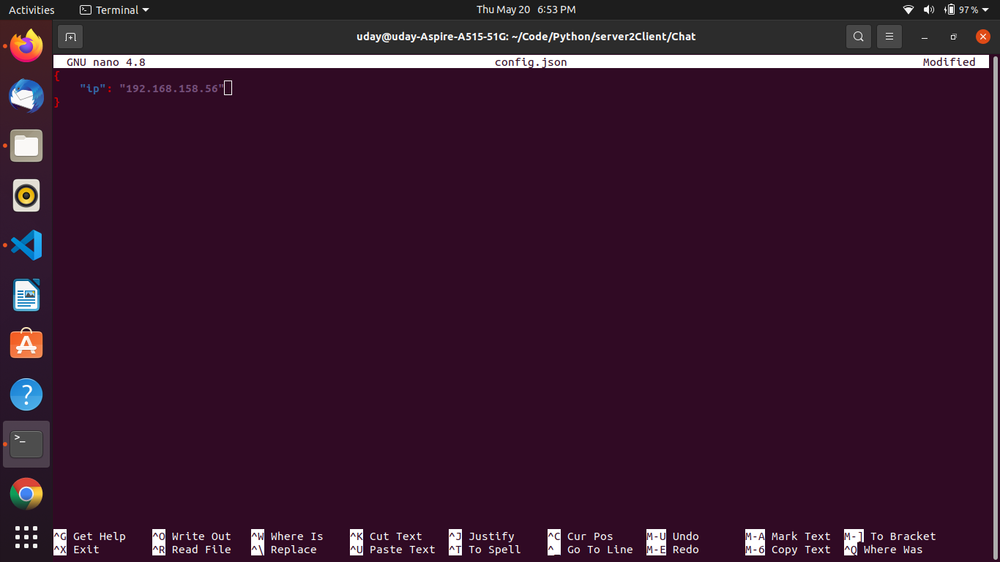

# Chat
A Simple App to just chat with yourself, when you're bored.

## Usage:
### Just after cloning into the project script.
``` git clone https://github.com/UdayKiranBayya/Chat.git ```

### Get into the directory(repo).
``` cd Chat ```
### Editing the 'config.txt'.
``` nano config.json ```

Then you will se somethink like this.


### 
Now quickly provide your system's ip address in the json.
1.To know your ip address (Linux distributions) click 👉️ https://phoenixnap.com/kb/how-to-find-ip-address-linux

2.To know your ip address (Windows) click 👉️ https://www.med.unc.edu/it/guide/operating-systems/how-do-i-find-the-host-name-ip-address-or-physical-address-of-my-machine/

After editing the config.json, it will look like this, Note it's just an example.



