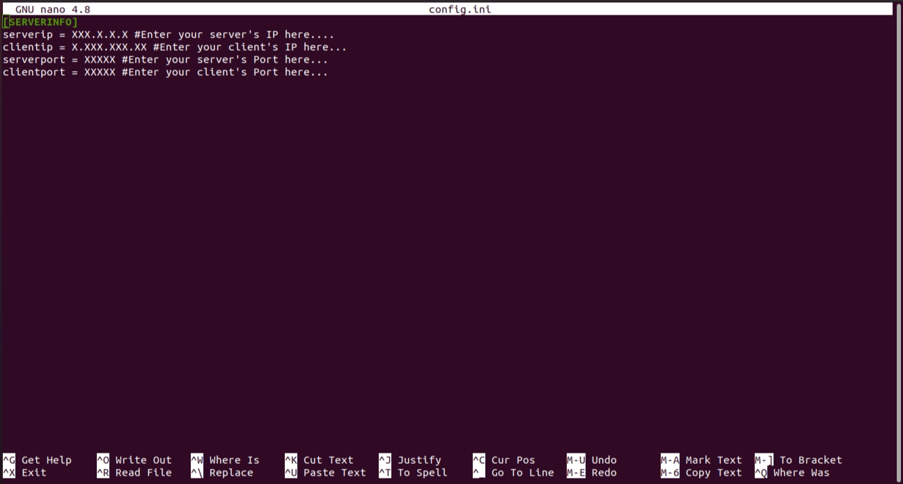

# Chat
A Simple App to just chat with yourself, when you're bored.

## Note:
* This tool is basically made for connecting 2 devices and having a chat with them, in a local network(i.e, 2 devices connected to the same WiFi network, or to the mobile hotspot of the server.), in a local machine itself, and also throughout the wide area network (Internet)
## Usage:
### Just after cloning into the project script.
``` git clone https://github.com/UdayKiranBayya/Chat.git ```

### Get into the directory(repo).
``` cd Chat ```
### Editing the 'config.ini'.
``` nano config.ini ```

* Then you will se somethink like this.


### For local network communications:
#### Now quickly provide your private ip address, and a unused port in the config file.

#### Note:
* serverip and clientip will be same in this scenario.
* And the serverport and clientport should be also same ports affixed by you.
* Note, in this scenario the server and client scripts should be run on 2 different devices but, bot must be connected to a same LAN.

1. To know your private ip  (Linux distributions) click 👉️ https://phoenixnap.com/kb/how-to-find-ip-address-linux

2. To know your private ip (Windows and macOS) click 👉️ https://www.avg.com/en/signal/find-ip-address?v=b

3. To know more about Internet Protocols (IP) click 👉️ https://www.avg.com/en/signal/find-ip-address?v=b and  also read 👉️ https://www.avast.com/c-ip-address-public-vs-private


``` python server.py ```


### For fun communications within a local machine:
#### Now quickly provide the local host address(i.e, 127.0.0.1) and a unused port, inside the config.ini as said before.

#### Note:
* serverip and clientip will also be same in this scenario.
* And the serverport and clientport should be also same ports affixed by you.
* In this scenario both the server and client scripts should be running on a same device connected to any network.

1. Now run ``` python server.py ```


## For communication throughout the wide area networks:
* Provide your localhost address (i.e, 127.0.0.1) at the serverip section.
* And now provide your forwarded public ip address , wait don't know how to get a forwarded ip address, it will be done in a few steps:
1. Install ngrok software into your system and authenticate yourself by the software given unique authtokenafter, signing in with them, for installing and setting up the software follow 👉️ https://ngrok.com/download and for usage follow 👉️ https://ngrok.com/docs
2. After a sucessful installation, use the below command to forward your port.
``` ngrok tcp <internal port> ```

3. Then you will be getting  a forwarded link, where actually your local port is forwarded, get it and run the command below.
``` ping <the forwarded link copied before> ```

4. By doing this you will be getting a public forwarded ip, get it and provide it in the configuration file as clientip. And also provide the new port after forwarding as the clientport.

5. Now run ``` python server.py ```

6. Note in this scenario run the client script in another device which isn't connected to the LAN, in which your server script is running.

### Starting your client program:
* Now with the same configurations according to your scenario(i.e, LAN, Local Machine, WAN communications)  provided above run the client.py script.
 ``` python client.py ```

:) That's it, now n'joy the chatting between your own server and client systems.

#### MADE WITH ❤️ FROM INDIA


